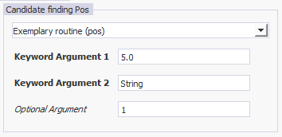

# Developer manual - EVE software

## Contents
<!-- TOC -->
- [Introduction](#introduction)
- [Expandability of EVE](#expandability-of-eve)
- [Detailed information on input/output data of EVE](#detailed-information-on-inputoutput-data-of-eve)
     - [Candidate Finding](#candidate-finding)
         - [Pseudo-code explaining the structure of candidates finding output](#pseudo-code-explaining-the-structure-of-candidates-finding-output)
     - [Candidate Fitting](#candidate-fitting)
         - [Pseudo-code explaining the structure of candidate fitting output](#pseudo-code-explaining-the-structure-of-candidate-fitting-output)

<!-- /TOC -->

# Introduction
EVE is a software platform developed for the analysis of single-molecule imaging data captured by event-based sensors. This document is for developers who want to add functionality to EVE. EVE is a highly open framework and can easily be expanded upon. Expandability of EVE is possible in the following routines (with more detailed information following):

- **Candidate Finding**

  Routines involved in finding which events belong to a single molecule localization/PSF

  **Input**: All events (possibly filtered by polarity), settings, function arguments

  **Output**: Found candidates, metadata

- **Candidate Fitting**

  Routines involved in fitting the events of each candidate cluster to determine the x-, y- (,z-) and t-coordinates of each single molecule. Some fitting methods rely on using ‘Event distributions’ (below)

  **Input**: All found candidates, settings, function arguments

  **Output**: Localizations (x,y(,z),t-coordinates), metadata

- **Event distributions**

  Classes to create varying distributions from the events

  **Input**: Events, settings, function arguments

  **Output**: Histogram classes with certain arguments

- **Post-processing**

  Routines involved in post-processing the localization data, either for further filtering or data quantification or for calculating quantitative metrics

  **Input**: Localizations, candidates, settings, function arguments

  **Output**: (Possibly changed) localizations, metadata

- **Visualization**

  Routines that visualize the current localization list

  **Input**: Localizations, settings, function arguments

  **Output**: 2D array containing image data, scale of the image

- **Candidate preview**

  Routines that visualize individual candidates for user inspection

  **Input**: Candidates, localizations, all events, settings, function arguments

  **Output**: None (updated figure)

# Expandability of EVE

All routines, with the exception of the Event distributions, follow the same method of expandability. One or multiple routines should be written in a .py file, and placed within a sub-folder in the main EVE GUI folder, or alternatively in the AppData/Local/UniBonn/Eve folder. EVE will automatically find and add all suitable routines into the GUI. The .py files should start with the following defined structure:

```python
def __function_metadata__():
 return {
  "FunctionTitle": {
   "required_kwargs": [
    {"name": " kwarg1", "description": "Some Description", "default": 5.0, " type": float, "display_text":                                          "Keyword Argument 1"},
    {"name": " kwarg2", "description": "Some other Description", "default":"string", "type": str, "display_text": "Keyword Argument 2"}
   ],
   "optional_kwargs": [
    {"name": "oarg", "description": "An optional argument", "default":1, "type":int, "display_text":"Optional Argument"},
   ],
   "help_string": "This is an exemplary routine.",
    "display_name": "Exemplary Routine"
  }
 }
```

This function would be displayed as such by the EVE GUI (exemplary for candidate finding on positive events):



The function\_metadata function describes important metadata for the function(s) that should be displayed and callable:

- One or multiple functions can be defined with this structure
- The same .py file requires a function called the same as “FunctionTitle”

  The following parameters should be created: 

  **display\_name** (optional) provides the function name which is visible for the user

  **help\_string** (optional) provides a description of the function for the user

  **required\_kwargs** (required)** defines required keyword arguments that your function expects.

  **optional\_kwargs** (required)** defines optional keyword arguments that your function could use.

- For each keyword argument, the following should be provided:

  name (required): the internal name of the keyword argument

  display\_text (optional): the name visible for the user 

  description (optional): a description of the argument that users can see in the EVE GUI default (optional): the default value of this argument 

  type (optional): the expected type of the input, options are [float, int, str, “fileLoc”]

  The “fileLoc” value indicates a file which can be found by the user

# Detailed information on input/output data of EVE
All data has these two input variables:

*settings*: named dictionary with (advanced) settings.  
*kwargs*: dictionary with named entries of the function (as defined in *\_\_function\_metadata\_\_()*)

## Candidate Finding
**Function definition**  
<br>*def function(npy\_array, settings,\*\*kwargs):
return candidates, performance\_metadata*

**Input**  
<br>*npy\_array*: numpy.ndarray with one entry for each event. Each entry has dtype([('x', '<u2'), ('y', '<u2'), ('p', '<i2'), ('t', '<i8')]) structure, with x/y in pixels, p either 0 or 1 (negative or positive), and t in microseconds 

**Output**  
<br>*candidates*: dictionary where each entry is a candidate. Each entry should have three named sub-entries:  
<br><p style='margin:0;margin-left: 20px;display:inline-block'> *events:* pandas DataFrame with N-by-4 array, array names x,y,t,p (same units as input, N being the number of events in this cluster).</p>  
<br><p style='margin:0;margin-left: 20px;display:inline-block'>*N\_events*: Number of events</p>  
<br><p style='margin:0;margin-left: 20px; display:inline-block'>*cluster\_size*: [size\_x, size\_y, size\_t] of the cluster (in [pixel, pixel, microsecond] units) </p>

*performance\_metadata*: string with details on the performance. Will be stored in the metadata.txt output.

### Pseudo-code explaining the structure of candidates finding output
```python
candidates = {}
for cluster in all_clusters:
    clusterEvents = all_cluster_events(cluster_id==cluster)
    candidates[cluster] = {}
    candidates[cluster]['events'] = clusterEvents
    candidates[cluster]['N_events'] = len(clusterEvents)
    candidates[cluster]['cluster_size'] =...
    [np.max(clusterEvents['y'])-np.min(clusterEvents['y']),...
    np.max(clusterEvents['x'])-np.min(clusterEvents['x']),...
    np.max(clusterEvents['t'])-np.min(clusterEvents['t'])]

metadata = 'The file ran as expected!'
```

## Candidate Fitting
For the candidate fitting, the *\_\_function\_metadata\_\_()* needs to be expanded to provide information about the dist\_kwarg and time\_kwarg. These structures contain information about which XY distribution and Time distribution can be selected by the user. If these are not defined, an XYT-combined fitting is ran (which should result in XY ánd time fitting results). In an XY+Time distribution, the candidate fitting routine should only provide the XY fitting result, since the Time distribution is handled independently. Please look at the following examples for implementation details:

Example for XY+Time: GaussianFitting

Example for XYT: Radial\_Symmetry – RadialSym3D.

**Function definition**  
<br>*def function(candidate\_dic, settings,\*\*kwargs):
return localizations, fit\_i o of metadata. Will be stored in the metadata.txt output.*

### Pseudo-code explaining the structure of candidate fitting output

```python
<!-- TOC -->

- [Developer manual - EVE software](#developer-manual---eve-software)
    - [Contents](#contents)
- [Introduction](#introduction)
- [Expandability of EVE](#expandability-of-eve)
    - [Detailed information on input/output data of EVE](#detailed-information-on-inputoutput-data-of-eve)
        - [Candidate Finding](#candidate-finding)
            - [Pseudo-code explaining the structure of candidates finding output](#pseudo-code-explaining-the-structure-of-candidates-finding-output)
        - [Candidate Fitting](#candidate-fitting)
            - [Pseudo-code explaining the structure of candidate fitting output](#pseudo-code-explaining-the-structure-of-candidate-fitting-output)
        - [Post-processing](#post-processing)
        - [Visualization](#visualization)
        - [Candidate preview](#candidate-preview)
        - [Event distributions](#event-distributions)
        - [Temporal Fitting](#temporal-fitting)

<!-- /TOC -->*: string with info of metadata. Will be shown in the Run info GUI tab.

## Visualization
**Function definition**  
<br>*def function(resultArray, settings,\*\*kwargs):
return image, scale*  

**Input**  
<br>*resultArray*: See Candidate Fitting ‘localizations’ output. Uses the currently found results as in Eve (i.e. could be adapted via Post-processing)*.*

**Output**  
<br>*image*: numpy.ndarray of pixel-values of the resulted image. Will be displayed in the ‘Visualization’ tab  
<br>*scale*: float value of pixel-to-micrometer size (e.g. value of 0.01 means 0.01 micrometer per pixel, or 10 nm per pixel). Used to set the scale bar in the ‘Visualization’ tab.  

## Candidate preview
**Function definition**  
<br>*def function(findingResult, fittingResult, previewEvents, figure, settings,\*\*kwargs):
return None*

**Input**  
<br>*findingResult*: See Candidate Finding ‘candidates’ output. The information of a single candidate is provided.  
<br>*fittingResult:* See Candidate Fitting ‘localizations’ output. The information of a single localization is provided.  
<br>*previewEvents*: Unused  
<br>*figure*: Matplotlib Figure object. Should be addressed by e.g. performing *ax = figure.add\_subplot(111); ax.bar(…).* figure.show() does not have to be called.

**Output**  
<br>*None*. Expected that *figure* is updated properly.

## Event distributions
These Event distributions follow a different expandability method, and cannot be adapted from the AppData folder, but only from changing the EventDistributions/eventDistributions.py file in the EVE installation folder.

Each Event distribution is defined by a class (e.g. *class Hist1d\_t()* ). These classes should have a *\_\_call\_\_(self, events, \*\*kwargs)* function, which should return the wanted distribution and bin edge positions.

Please use the existing classes in *eventDistributions.py* for detailed info.

## Temporal Fitting
Same structure as Event distributions, only for fitting time distributions.


