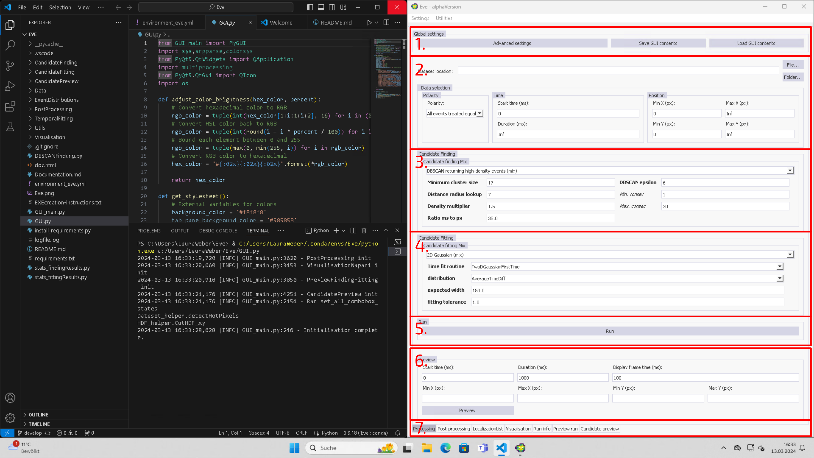
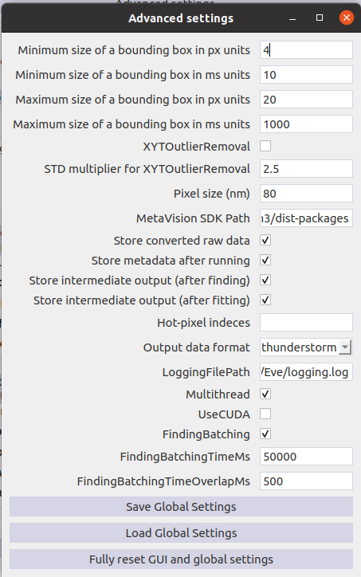
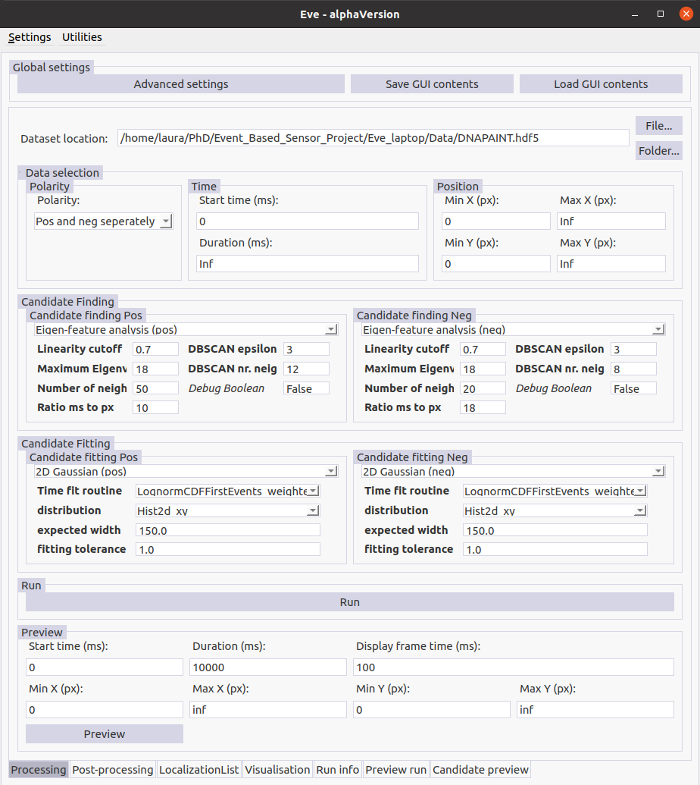

# Eve - General-purpose software for eve-SMLM localization

## About Eve
Eve is a user-interfaced software package that provides a plethora of options to localize emitters from single molecule localization microscopy (SMLM) experiments performed on event-based sensor (eveSMLM).

Event-based data differs fundamentally from conventional camera images. Unlike traditional sensors, event-based sensors only capture intensity changes, registering them as either positive (when intensity surpasses a predefined threshold) or negative events (when intensity drops below a predefined threshold). As a result, only a list of x and y pixel coordinate pairs is stored together with the detected event polarities and timestamps.

Eve is designed to quickly and directly process and analyse event-based single molecule data without the need to convert event lists back to image frames, followed by traditional SMLM data analysis. 
The event-based data analysis is divided into two main parts:
1. **Candidate Finding:** The complete event-list is searched for characteristic event clusters that are generated by blinking fluorophores. Potential candidate clusters are then extracted and returned for further processing.
2. **Candidate Fitting:** The x,y,t-localization is determined for each candidate cluster.

Eve allows flexible combinations of different finding and fitting routines to optimize the localization results for the specific event-based data. Besides a variety of different finding and fitting algorithms, Eve also offers various preview options, visualisation tools and post-processing functions.

Eve is written in Python and structured in such a way, that is easy to implement and add new functionalties in form of new finding, fitting routines, etc. 
## Version
The `main` branch contains the latest running version of the software. The latest developments are stored in the `develop` branch.
## How to install and run Eve
This software was tested under Linux Ubuntu 20.04 and Windows 10. Besides the drift correction module `DriftCorr_DME: DriftCorr_entropyMin` that contains and uses pre-compiled dll-files and is therefore only running on Windows, everthing is running under Linux and Windows.

The software requires Python 3.9.18.
### Installation instructions
1. First download Eve or clone it to your local repository using git:
    ```bash
    git clone https://github.com/Endesfelder-Lab/Eve.git
    ```
2. Install required python dependencies
    #### With `virtualenv`
    Replace `PYTHON_PATH` by your python path, e.g. `/usr/bin` and `ENVIRONMENT_PATH` by the path to the virtual environments on your machine and follow the instructions below:
    ```bash
    virtualenv -p PYTHON_PATH/python3.9.18 ENVIRONMENT_PATH/Eve
    source ENVIRONMENT_PATH/Eve/bin/activate
    pip install -r requirements.txt
    ```
    #### With `conda`
   Simply follow the instructions below, this will also install the correct python version on your system:
    ```bash
    cd Eve
    conda env create -f environment_eve.yml
    conda activate Eve
    ```
3. Optional:\
Eve can read and process event-based data in `.npy` and `.hdf5` format. Additionally the `.raw` format of [Prophesee](https://www.prophesee.ai/) can be used. If you have `.raw` data that you want to analyze you need to install the [Metavision SDK from Prophesee](https://docs.prophesee.ai/stable/installation/index.html) in addition.
### Running Eve
To open the graphical user interface and run Eve, first activate the python environment you created during the installation. Then run `GUI.py` with Python.
## Quick Start Guide
### Set up the Processing Tab
Running `GUI.py` will open Eve's graphical user interface. 

The main window has 7 major parts that are marked with red boxes and are described in more detail in the following.
1. Global settings: Here, you can open the `Advanced settings`, save the current GUI configuration and settings with `Save GUI contents` or load a specific GUI configuration with `Load GUI contents`. Open the advaced settings, and change the settings in accordance with the image below.\
   \
   
3. Data to analyse: Here, you specify the data that will be analysed in the following. You can either select a single file (in `.npy`, `.hdf5` or `.raw` format) or a folder. If you select a folder all files in the folder will be analysed one after another.

   The folder `Data` contains an event-based acquisition of a DNA nanoruler (`DNAPAINT.hdf5`) which we will use in this tutorial. Fill the path entry field `Dataset localtion:` with the corresponding path to the nanoruler dataset.

   In the `Data selection` box, you can now further specify which parts of the data should be analysed and how. You have different options for `Polarity`, `Time` and `Position`. Choose `Pos and neg seperately` as `Polarity` option while leaving the remaining settings unchanged. Thereby, you simply load the all events without temporal or spatial constraints. By selecting `Pos and neg seperately` all subsequent analysis steps will be run on the positive and negative events distinctly. As you can see the GUI has adapted to your selection and you can now choose finding and fitting routines for positive and negative events seperatly.\
   \

4. Candidate Finding routine: Here, you can select among different candidate finding routines. Choose `Eigen-feature analysis`, both for positive and negative events and change the settings as shown in the screenshot above.
5. Candidate Fitting routine: Here, you can specify which fitting routines you want to use to get localizations for each candidate, cluster. Choose `2D Gaussian` and again modify all other parameters as shown in the screenshot above.
### Adjust Advanced Options
### Perform a Preview Run
### View the Preview Run Results
### Explore the Candidate Preview
### Excute a full Run
### Visualize the Localization Results
### Apply a Drift Correction
### Apply additional Localization Filters
### Estimate the Localization Precision
### Analyse the On-time Distribution
