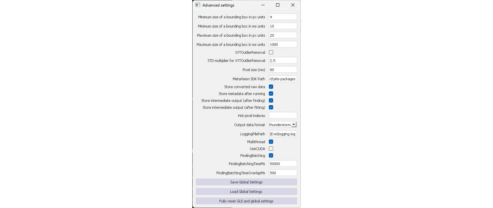
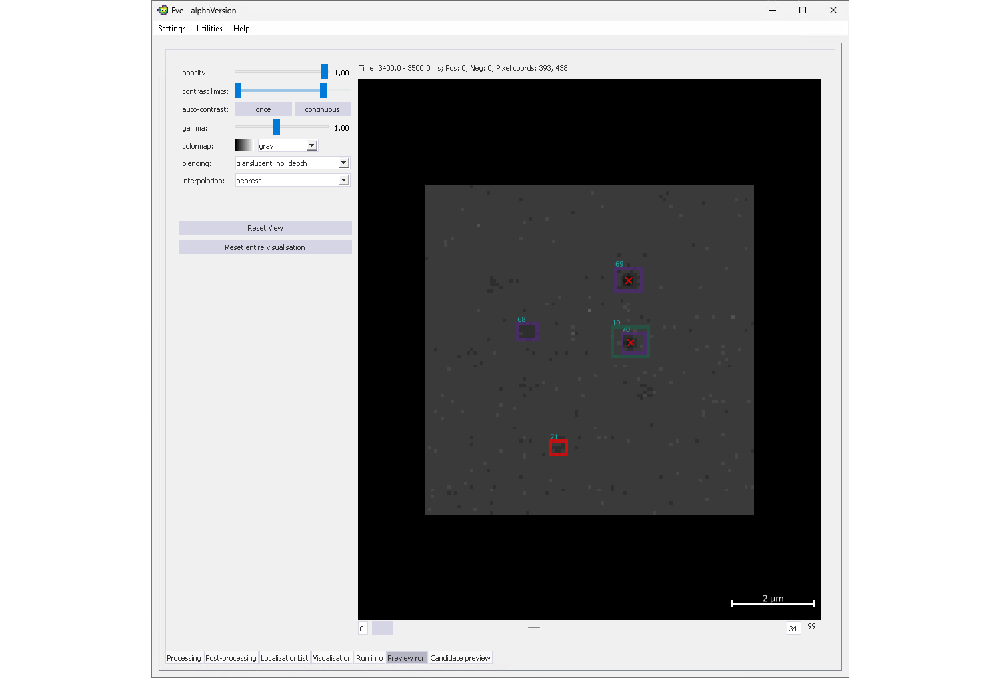
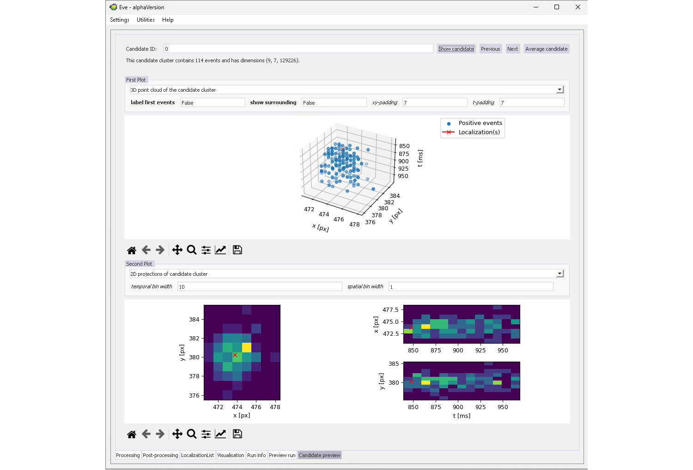
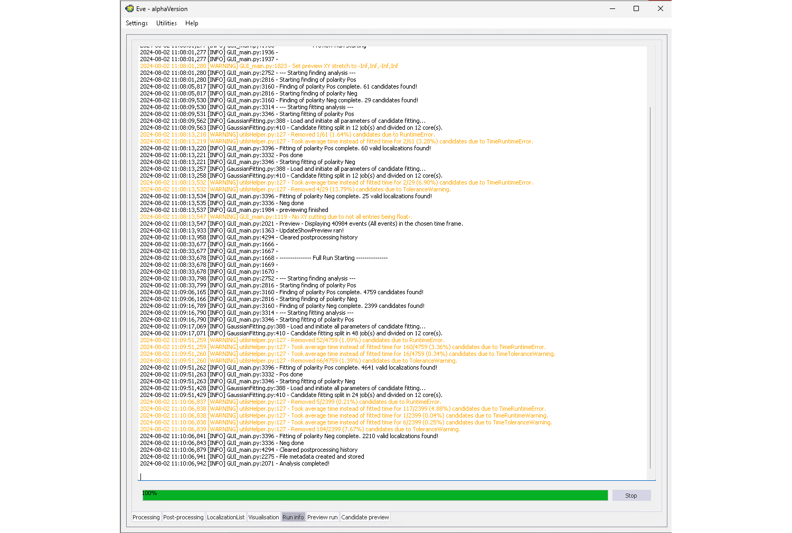
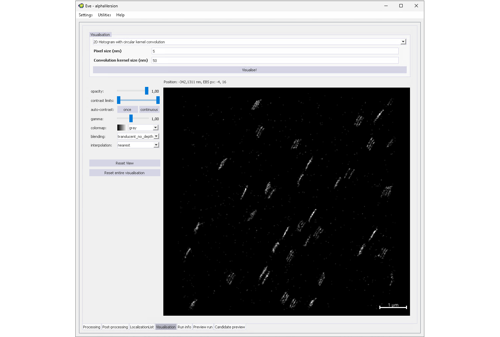
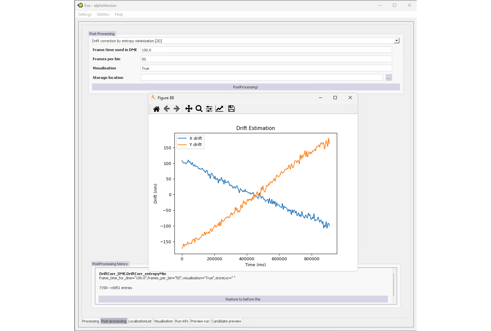
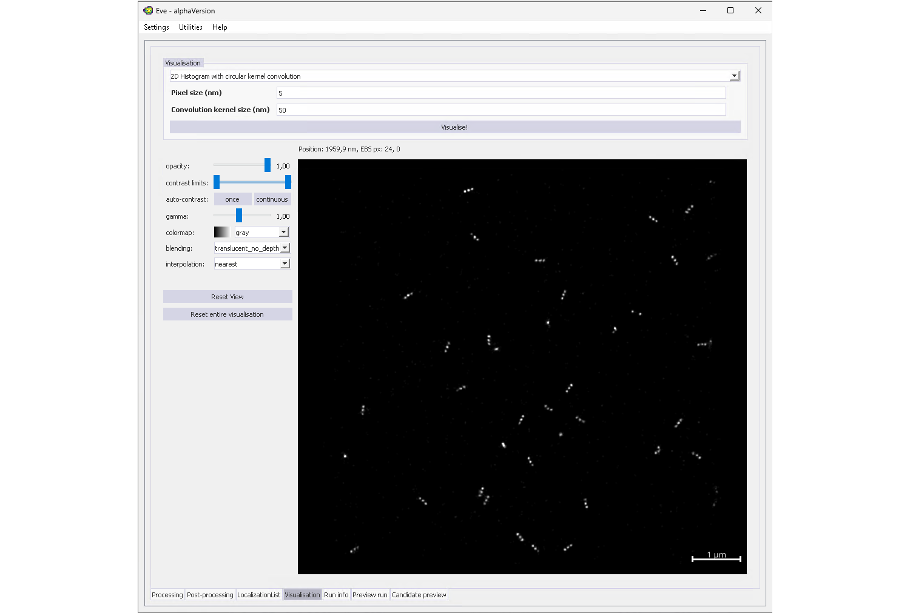
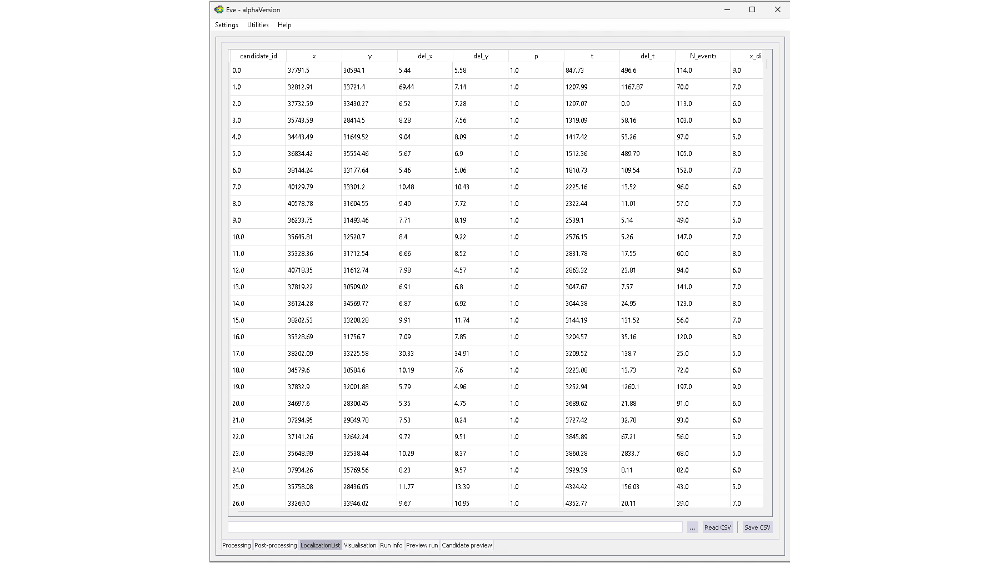
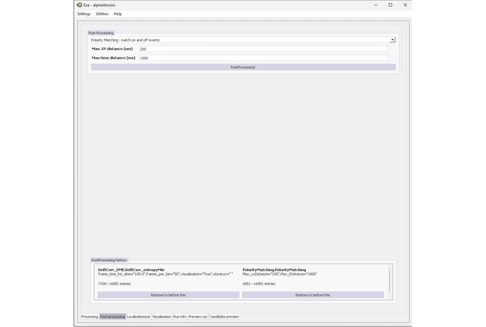

# Eve - General-purpose software for eve-SMLM localization

## About Eve
Eve is a user-interfaced software package that provides a plethora of options to localize emitters from single molecule localization microscopy (SMLM) experiments performed on event-based sensor (eveSMLM).

Event-based data differs fundamentally from conventional camera images. Unlike traditional sensors, event-based sensors only capture intensity changes, registering them as either positive (when intensity surpasses a predefined threshold) or negative events (when intensity drops below a predefined threshold). As a result, only a list of x and y pixel coordinate pairs is stored together with the detected event polarities and timestamps.

Eve is designed to quickly and directly process and analyse event-based single molecule data without the need to convert event lists back to image frames, followed by traditional SMLM data analysis. 
The event-based data analysis is divided into two main parts:
1. **Candidate Finding:** The complete event-list is searched for characteristic event clusters that are generated by blinking fluorophores. Potential candidate clusters are then extracted and returned for further processing.
2. **Candidate Fitting:** The x,y,(z),t-localization is determined for each candidate cluster.

Eve allows flexible combinations of different finding and fitting routines to optimize the localization results for the specific event-based data. Besides a variety of different finding and fitting algorithms, Eve also offers various preview options, visualisation tools and post-processing functions.

Eve is written in Python and structured in such a way, that is easy to implement and add new functionalties in form of new finding, fitting routines, etc. 
## Version
The `main` branch contains the latest running version of the software. The latest developments are stored in the `develop` branch.
## How to install and run Eve
This software was tested under Linux (Ubuntu 20.04) and Windows 10. Besides the drift correction module `DriftCorr_DME: DriftCorr_entropyMin` and the Gaussian visualization methods (`Gaussian_display: GaussianKernal_fixedSigma`, `Gaussian_display: GaussianKernal_locPrec`) that use pre-compiled dll-files and are therefore only running on Windows, everthing is running under Linux and Windows.

The software requires Python 3.9.18.
### Installation instructions
1. First download Eve or clone it to your local repository using git:
    ```bash
    git clone https://github.com/Endesfelder-Lab/Eve.git
    ```
2. Install required python dependencies
    #### With `virtualenv`
    Replace `PYTHON_PATH` by your python path, e.g. `/usr/bin` and `ENVIRONMENT_PATH` by the path to the virtual environments on your machine and follow the instructions below:
    ```bash
    virtualenv -p PYTHON_PATH/python3.9.18 ENVIRONMENT_PATH/Eve
    source ENVIRONMENT_PATH/Eve/bin/activate
    pip install -r requirements.txt
    ```
    #### With `conda`
   Simply follow the instructions below, this will also install the correct python version on your system:
    ```bash
    cd Eve
    conda env create -f environment_eve.yml
    conda activate Eve
    ```
3. Optional:\
Eve can read and process event-based data in `.npy` and `.hdf5` format. Additionally the `.raw` format of [Prophesee](https://www.prophesee.ai/) can be used. If you have `.raw` data that you want to analyze you need to install the [Metavision SDK from Prophesee](https://docs.prophesee.ai/stable/installation/index.html) in addition.
### Running Eve
To open the graphical user interface and run Eve, first activate the python environment you created during the installation. Then run `GUI.py` with Python.
## Quick Start Guide
### 1. Set up the Processing Tab
Running `GUI.py` will open Eve's graphical user interface which you can see on the right side of the figure.


The main window has 7 major parts that are marked with red boxes and are described in more detail in the following.
1. **Menu bar:** By clicking on `Settings`, you can open the `Advanced settings`, save the current GUI configuration and settings or load a specific GUI configuration. Under `Utilities` you will find some additional functionalities to pre-process the raw event data files before processing them with Eve. \
Now, open the advaced settings, and change the settings in accordance with the image below.\
   \
   
2. **Data to analyse:** Here, you specify the data that will be analysed in the following. You can either select a single file (in `.npy`, `.hdf5` or `.raw` format) or a folder. If you select a folder all files in the folder will be analysed one after another.

   The folder `Data` contains an event-based acquisition of a DNA nanoruler (`DNAPAINT.hdf5`) which we will use in this tutorial. Fill the path entry field `Dataset localtion:` with the corresponding path to the nanoruler dataset.

   In the `Data selection` box, you can now further specify which parts of the data should be analysed and how. You have different options for `Polarity`, `Time` and `Position`. Choose `Pos and neg seperately` as `Polarity` option while leaving the remaining settings unchanged. Thereby, you simply load the all events without temporal or spatial constraints. By selecting `Pos and neg seperately` all subsequent analysis steps will be run on the positive and negative events distinctly. As you can see, the GUI has adapted to your selection and you can now choose finding and fitting routines for positive and negative events seperatly.\
   \

3. **Candidate Finding routine:** Here, you can select among different candidate finding routines. Choose `Eigen-feature analysis`, both for positive and negative events and change the settings as shown in the screenshot above.
4. **Candidate Fitting routine:** Here, you can specify which fitting routines you want to use to get localizations for each candidate, cluster. Choose `2D Gaussian` again for both polarities and modify all other parameters as shown in the screenshot above. \
Everything is now ready for the first run. Before you start the first run, save the GUI settings (`Settings -> Save GUI contents`). When you open Eve again, the last saved GUI settings will be loaded automatically.
5. **Run box:** When you click run, a full run will be executed.
6. **Preview box:** To check whether the current selection of parameters for the candidate finding is suitable for your data or needs further fine tuning, you can perform a preview run. Doing so, will perform the analysis routines only on a smaller subset of the data that you can specify in the preview box. To view the event data, which in its raw form is just a list of events, it is converted into a format that is easier for humans to view and interpret (images). You must therefore specify a `display frame time` together with the data selection you would like to display. 
7. **Tab menu:** Here, you can change between different tabs: `Processing` (current tab), `Post-processing` (follow up analysis after a full run), `Localization List` (view, import and export localization tables), `Visualization` (visualize the super-resolved event SMLM data), `Run Info` (info about current run), `Preview run` (preview of finding and fitting performance, useful for parameter tweaking) and `Candidate Preview` (view single candidate clusters and their x,y,t localization results)
### 2. Perform a Preview Run
Now, change the `Duration` in the preview box to 10000ms and then press `Preview`. This will immediately open the run info. 
By leaving the settings `min` and `max` for x,y empty, you will get a preview for the entire FOV without spatial restrictions. \
Switch to the `Preview run` tab, as soon as the preview run is complete (`UpdateShowPreview ran!` is printed in `Run info` tab). 



Each candidate cluster found by the candidate finding routine will be highlighted with an orange or red box and gets a unique candidate ID that is here displayed in blue. A red box indicates that a failed fit, meaning that no localization could be generated. All localizations are marked as red crosses in the frame where the x,y,t localization is found.
You can use the slider below the image to view all the frames that were created in the preview run.
### 3. Explore the Candidate Preview
By either double-clicking on a candidate in the preview image or switching to the last tab, you can open the `Candidate preview`.
Change the plot options for the first plot to `3D point cloud of the candidate cluster` and for the second plot to `2D projections of candidate cluster`. 
In a preview run you can also display surrounding events to evaluate if the full candidate cluster is found. To do so, set `show surrounding` to `True` and add a custom x,y and t-padding in the first plot options.


By the `Previous` and `Next` buttons you can simply click through all the clusters found to evaluate finding and fitting results. 



### 4. Execute a full Run
If you are satisfied with the results of the current selection of finding and fitting parameters, you can start a complete run. To do so, switch back to the `Processing` tab and click `Run`. \ 
The `Run Info` tab will again open automatically and show additional info regarding the current run, e.g. number of candidates and valid localizations found as well as a number of candidates (absolute and percentage) that was removed during fitting.



### 5. Visualize the Localization Results
As soon as the full run is completed, you can visualize your results. Therefore, switch to the `Visualization` tab, select `Histogram_Convolution: Histogram_convolution` and press `Visualize`.



As you can see the sample data is rather drifty and we can't see our DNA nanorulers yet.

### 6. Apply a Drift Correction
To apply a drift correction, switch to the `Post-processing` tab.
#### Under Windows
Windows users can choose between two different drift correction routines. Select `DriftCorr_DME: DriftCorr_RCC` and press `Post processing!`. This will open a pop-up window showing the estimated x,y-drift. Additionally, an entry was added to the `Post-processing history` at the bottom of the tab. By clicking `Resotre to before this` you can undo the last post-processing step. 



#### Under Linux
For Linux users currently only one method (`Drift correction by entropy minimization`) is working. Select the method and set the `Use ConvHist(Linux)` flag to `True`. Now press `Post processing!` which will open a pop-up window showing the estimated x,y-drift. Additionally, an entry was added to the `Post-processing history` at the bottom of the tab. By clicking `Resotre to before this` you can undo the last post-processing step. 


As you can see, the drift estimated by the two different drift correction methods is quite similar. You can now switch again to `Visualization` and press `Visualize!` to view the super-resolved event SMLM image.



### 7. The final Localization List

The drift corrected localization list is not saved automatically. To export the list in `.csv` format, switch to the `Localization List` tab and press `Save CSV`.



### 8. Estimate the Localization Precision

To get an estimate on the localzation precision we can make use of the fact, that for each fluorophore blink we measure the on and off-switching. This means, that we have one cluster of positive polarity for the on switching and one cluster of negative cluster polarity. By comparing the distances between the corresponding positive and negative localizations we can get our localization precision 




### 9. Metadata, run and result files


