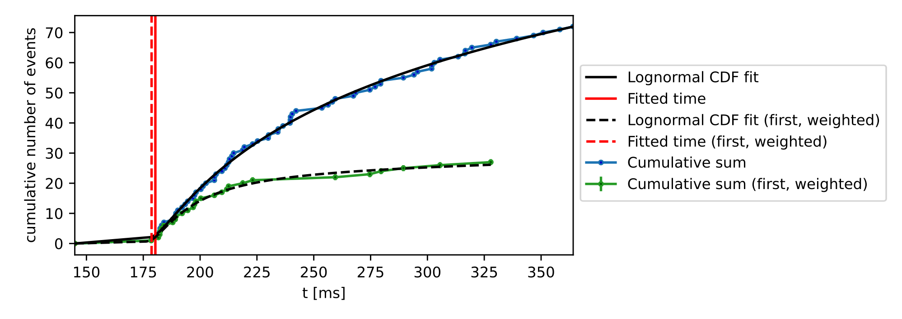

---
bibliography: Markdown_info\citations.bib
csl: ieee.csl
figureTitle: |
  Figure #
---
<!--
cd C:\Users\Koen Martens\Documents\GitHub\Eve
pandoc ScientificBackground.md -o ScientificBackground.pdf --bibliography=Markdown_info\citations.bib --csl=ieee.csl --citeproc --pdf-engine=xelatex -V geometry:margin=1in
-->

# Scientific background of EVE

# Contents
<!-- TOC -->
- [Introduction](#introduction)
- [Finding](#finding)
    - [Eigenfeature-based finding](#eigen-feature-based-finding)
    - [DBSCAN-based cluster finding](#dbscan-based-cluster-finding)
    - [Frame-based finding](#frame-based-finding)
- [Fitting](#fitting)
    - [Fitting distributions](#fitting-distributions)
    - [Mean X,Y position](#mean-xy-position)
    - [2D Gaussian](#2d-gaussian)
    - [2D Logarithmic Gaussian](#2d-logarithmic-gaussian)
    - [3D Astigmatic Gaussian](#3d-astigmatic-gaussian)
        - [Model function](#model-function)
        - [Calibration](#calibration)
        - [Estimating the axial position](#estimating-the-axial-position)
    - [Phasor-based Fitting](#phasor-based-fitting)
    - [Radial Symmetry Fitting](#radial-symmetry-fitting)
    - [Temporal fitting](#temporal-fitting)
        - [Lognormal CDF fitting](#lognormal-cdf-fitting)
        - [Temporal Gaussian fitting](#temporal-gaussian-fitting)
- [Post-processing and Evaluation](#post-processing-and-evaluation)
    - [Polarity matching post-processing](#polarity-matching-post-processing)
        - [Polarity matching](#polarity-matching)
        - [Localization precision](#localization-precision)
        - [Estimation of the emitter fluorescent On-time](#estimation-of-the-emitter-fluorescent-on-time)
    - [Drift correction](#drift-correction)
    - [Visualisation](#visualisation)
- [References](#references)

<!-- /TOC -->

# Introduction
EVE is a software platform developed for the analysis of single-molecule imaging data captured by event-based sensors. The software is methodically divided into three integral modules, each serving a distinct purpose in the data analysis pipeline for event-based single-molecule data.

1. **Candidate Finding:** This initial module is responsible for identifying and isolating potential single-molecule signals within the event data. It effectively filters the raw input to extract candidate events for further analysis.
2. **Candidate Fitting:** Once candidates are identified, this module precisely localizes the single molecules spatiotemporally. 
3. **Post-Processing and Evaluation:** This module includes various routines to modify and interpret the data.

# Finding

## 1. Eigenfeature-based finding
The Eigenfeature analysis finding methodology is based on spectral clustering methods, which are used in 3D point-cloud data classification such as LiDAR [@demantke_dimensionality_2012; @lin_eigen-feature_2014; @zhong_intrinsic_2009; @ng_spectral_2001]. Spectral clustering conceptually works as follows: First, for each point in a point cloud, a subset of the full point cloud is extracted, either by looking in a certain (multi-dimensional) radius, or alternatively by extracting the nearest N neighbors. Secondly, the corresponding covariance matrix of this subset is calculated and attributed to the original point. Finally, from this covariance matrix, the Eigenvalues are extracted. For event-based single-molecule data, three Eigenvalues are extracted, corresponding to the three dimensions (two spatial, one temporal). This is repeated for all points in the point cloud.

The extracted Eigenvalues contain information about local geometric features around each event. These geometric features are called ‘Eigenfeatures’. In EVE, we use Eigenfeatures to discriminate points belonging to single-molecule emissions from noise. In EVE, Eigenvalues are determined by assessing the nearest N neighbors of each event in the event point cloud (i.e. the complete dataset). N should be chosen to be roughly equal to the expected size of a single-molecule emission event, in combination with a temporal-to-spatial factor so that temporal and spatial distances can directly be compared. We then assess two Eigenfeatures:

1. The first Eigenfeature is the maximum Eigenvalue for each event in the point cloud. The maximum Eigenvalue is high if no local cluster features are present, and low if a local cluster feature is present (see Figure \ref{fig:eigenfeature}). Therefore, only events with an associated low maximum Eigenvalue can be considered to be part of single-molecule localizations. The cut-off Eigenvalue for a dataset can be determined by finding valleys via a wavelet transformation (Python scipy package).
1. The second Eigenfeature is the ‘Dimensionality’ [@demantke_dimensionality_2012; @lin_eigen-feature_2014]. The dimensionality can be derived by comparing the magnitude of the three extracted Eigenvalues of each event; if they are similar (i.e. $\lambda_1 \approx \lambda_3 \approx \lambda_3$), the local feature represents a volumetric structure, whereas if one Eigenvalue is much larger than the other (i.e. $\lambda_1$>>$\lambda_2$,$\lambda_3$), the local feature has a one-dimensional shape. In EVE, we use this to discriminate between single-molecule clusters (which are three-dimensional in shape when assessing time as the third dimension) and artifacts created by hot pixels (which are one-dimensional in the time dimension).

These two Eigenfeatures are combined to discriminate between signal and noise in EVE: if the first Eigenfeature is a lower value than the cutoff, and if the second Eigenfeature is considered volumetric, the single event is considered signal, otherwise noise. Downstream of this discrimination, a DBSCAN clustering routine is performed to further filter out spurious mis-labeled events. The events contained in these clusters are the candidates passed on for sub-pixel localization (Fitting).

{#fig:eigenfeature}

## 2. DBSCAN-based cluster finding
Density-based spatial clustering of applications with noise (DBSCAN) is an algorithm which clusters points based on their local density, and is routinely used in SMLM data analysis [@martens_raw_2022]. To save computation time for the DBSCAN algorithm, we remove most noise in two steps. First, we filter out events that show either an on-to-off-event or off-to-on-event sequence per pixel (Figure \ref{fig:DBSCAN} a, b). This is based on the rationale that single-molecule emissions usually trigger a sequence of multiple, consecutive on-events while turning on (and a sequence of multiple off-events when going dark) and thus trigger several thresholds and therefore show event sequences of the same polarity. Noise, on the other hand, is more likely to fluctuate around an on average constant background level, resulting in polarity-switching on-to-off and off-to-on event sequences. Second, for each event, a neighbor count is performed within a set spatiotemporal radius and compared against the average data density of the entire dataset (Figure \ref{fig:DBSCAN} c). Only events which have at least N (user-definable) times more neighbors than average remain, others are discarded. This ‘high-density dataset’ is then processed via DBSCAN with user-definable radius and minimum cluster points, to obtain single clusters for each single-molecule emission (Figure \ref{fig:DBSCAN} d). The bounding boxes of this cluster (optionally plus an additional area of user-defined spatiotemporal size) are then used to extract all, unfiltered events (i.e. raw events except hot-pixels, which are removed by a filter for consecutive > 30 positive or negative events) in this bounding box. These final candidate are passed on for sub-pixel localization.

![Schematic representation of the DBSCAN-based finding routine. a. Raw event data in a certain spatiotemporal area. b. Consecutive event-filtering, where only on-to-on and off-to-off sequences of events are remaining. c. Filtering for events that have a density higher than 1.5 times the average density in a [240 nm; 40 ms] radius. d. Clusters obtained when running the DBSCAN algorithm on the data in c with radius of 6 and minimum cluster points of 15.](Markdown_info/SciBG_DBSCAN.png){#fig:DBSCAN}

## 3. Frame-based finding
The frame-based finding methodology is an adapted version of the frame-based analysis used in [@cabriel_event-based_2022]. It naively reduces event-data to images using ‘frames’ of e.g. 100 ms. In these frames, standard image blob detection methods can be employed – in our implementation, an image wavelet segmentation method is used [@izeddin_wavelet_2012; @cabriel_event-based_2022]. This segmentation method reports a single spatial location (in pixel-units), and a user-defined area is extracted around this location. All events in this spatial area, in the temporal region defined by the frame, are passed on for sub-pixel localization.

# Fitting 
All fitting methods aim to determine the x-, y- (,z-) and t-coordinates for each candidate cluster. Since a candidate cluster consists of a three-dimensional point cloud of events (see Figure \ref{fig:fittingDistr} a), conventional single-molecule localization methods that process image data cannot be used directly. Various event-based fitting methods are implemented in EVE, which can be divided into spatial, temporal and spatio-temporal fitting methods. The first two methods can be flexibly combined to obtain the final localization, whereas the third method directly estimates both temporal and spatial coordinates together.

## 1. Fitting distributions
Besides directly analyzing the event point cloud data associated with a candidate (Figure \ref{fig:fittingDistr} a), it is also possible to reduce the data to a two-dimensional distribution, e.g. by counting all events per pixel (Figure \ref{fig:fittingDistr} b), by only taking the time of the first events per pixel (Figure \ref{fig:fittingDistr} c) or by calculating the mean time delay between all events per pixel (see Figure \ref{fig:fittingDistr} d). These distributions can then be fitted by a conventional two-dimensional function, e.g. a Gaussian, to obtain the x,y(,z) localization. 

{#fig:fittingDistr}

Within EVE, we separated the creation of the two-dimensional distribution from the fitting of this distribution. This allows a very flexible combination of both, method and distribution, to achieve the most accurate localization result by fully evaluating and exploiting the information stored in a candidate cluster. Two-dimensional fitting routines can be chosen from: Mean X,Y position; Gaussian; logarithmic Gaussian; astigmatic Gaussian; Radial Symmetry and Phasor routines. Two-dimensional distributions can be chosen from: The time of the first event; the total number of events; the average/median time of all events for each pixel; the average/minimum/maximum time delay between events for each pixel. 

## 2. Mean X,Y position
The average X,Y fitting method calculates the average x,y position for the chosen two-dimensional distribution, the uncertainties of the spatial x,y estimators are determined by the standard deviation in x and y. A temporal fitting method has to be selected separately.

## 3. 2D Gaussian
In analogy to conventional frame-based SMLM [@stallinga_accuracy_2010; @mortensen_optimized_2010] a 2D Gaussian least-square fit with variable x- and y-width ($\sigma_x$, $\sigma_y$) is implemented in EVE: 

$$\Large pdf(x,y)=A_1\cdot e^{-{(x-x_0)^2\over2\sigma_x^2} +{(y-y_0)^2\over2\sigma_y^2}}+A_2$$

The  ($x_0$,  $y_0$) - localization uncertainties given by the fit are used as a tolerance measure to discard imprecise fits where the fit uncertainty is larger than a user-definable factor times the pixel-size. A temporal fitting method has to be selected separately. 

## 4. 2D Logarithmic Gaussian
Due to the logarithmic nature of consecutive events a 2D logarithmic Gaussian fit was implemented similar to the 2D Gaussian fit:

$$\Large pdf(x,y)=log(A_1\cdot e^{-{(x-x_0)^2\over2\sigma_x^2} +{(y-y_0)^2\over2\sigma_y^2}}+A_2)$$

Again, the  ($x_0$,  $y_0$) - localization uncertainties given by the fit are used as a tolerance measure to discard imprecise fits where the fit uncertainty is larger than a user-definable factor times the pixel-size. A temporal fitting method has to be selected separately.

## 5. 3D Astigmatic Gaussian
This method is used to adjust 3D eveSMLM data generated by inserting a cylindrical length into the detection path to introduce a slight astigmatism into the image [@huang_three-dimensional_2008]: While the PSF appears round and symmetrical in the focal plane, it is elongated in the x and y directions above and below the focal plane, respectively. 
In this method, spatial and temporal fitting are separated again, so that an additional temporal fitting method must be selected.

### 5.1. Model function
A rotated elliptical Gaussian function with rotation angle $\phi$ is used to represent the astigmatic PSF:

$$\Large pdf(x,y)=A_1\cdot e^{-{\hat{x}^2\over2\sigma_{\hat{x}}^2} +{\hat{y}^2\over2\sigma_{\hat{y}}^2}}+A_2$$

where $A_{1,2}$ are constants, $\sigma_{x,y}$ are the imaged widths of the molecule along two perpendicular axes rotated by $\phi$ with respect to the x,y-axes and x,y are defined by:

$$\Large \hat{x} = (x-x_0)cos(\phi)-(y-y_0)sin(\phi)$$

$$\Large \hat{y} = (x-x_0)sin(\phi)+(y-y_0)cos(\phi)$$

Here, $x_0$ and $y_0$ again represent the sub-pixel coordinates of the molecule. 

### 5.2. Calibration
For calibration a sample containing fixed fluorescent beads is imaged at different z-planes. For each z-plane the average x- and y- width $\sigma_{\hat{x},\hat{y}}$ are determined and then fit by a fourth order polynomial:

$$ \Large
\sigma_{\hat{x},\hat{y}}(z) = a_{\hat{x},\hat{y}} \cdot (z - c_{\hat{x},\hat{y}})^2 + d_{\hat{x},\hat{y}} \cdot (z - c_{\hat{x},\hat{y}})^3 + e_{\hat{x},\hat{y}} \cdot (z - c)^4 + b_{\hat{x},\hat{y}}
$$

### 5.3. Estimating the axial position
The axial position is estimated by minimizing the distance between the ratio of measured x- and y-width $\Sigma_{\hat{x}} / \Sigma_{\hat{y}}$ to the calibrated ratio curve $\sigma_{\hat{x}}(z) / \sigma_{\hat{y}}(z)$, thus by

$$ \Large
z = \min_z \left( \left( \frac{\Sigma_{\hat{x}}}{\Sigma_{\hat{y}}} - \frac{\sigma_{\hat{x}}(z)}{\sigma_{\hat{y}}(z)} \right)^2 \right)
$$

The z-uncertainty is determined via the inverse Hessian matrix returned by the minimization routine.

## 6. Phasor-based Fitting
The phasor-based fitting routine is directly adapted from the pSMLM fitting for camera-based SMLM data [@martens_phasor_2018]. Briefly, the algorithm converts the 2D distribution to two phase vectors (or phasors) by calculating the first Fourier coefficients in x and y. The angles of these phasors are used to localize the center of the event distribution.

This concept can be expanded to the third dimension if a temporal binning is employed as well as a spatial binning.

## 7. Radial Symmetry Fitting

This fitting routine is an adapted version of the calculation of the radial symmetry centers for localization described in [@parthasarathy_rapid_2012]. The general idea is to estimate the center of radially symmetric intensity distributions, by tracing lines parallel to the image gradients in each point, where the distance of all lines is minimal at the center. This approach does not require knowledge of the exact shape of the distribution.
In the two-dimensional version, an array of event numbers per pixel is used instead of an array of pixel intensities. As shown in Figure \ref{fig:fittingDistr}, the two-dimensional event distribution also shows a clear radial symmetry. 
The concept is then expanded to a three-dimensional version in which the events are translated into a three-dimensional histogram of event numbers per voxel. Again the point of maximum radial symmetry can be calculated via the image gradient.

## 8. Temporal fitting
The aim of all temporal fitting methods is to get an accurate estimate for the true time of the brightness change. As the response time of sensor depends on imaging, sensor settings and pixel history and thus may be varying during the experiment, the time point of the emerging signal of a cluster as recorded by the sensor is taken as most consistent estimate of the true time.

### 8.1. Lognormal CDF fitting
In this temporal fitting method, the cumulative number of events is fitted by a lognormal CDF to obtain the starting time $t_0$ of the candidate cluster. Throughout the data, we observe a wide variety of different temporal profiles for candidate clusters. We therefore chose the cumulative distribution function (CDF) of the lognormal function for fitting, as it allows a large freedom in shape, while a starting time $t_0$ can be estimated consistently. 

$$ \Large
\text{CDF}(t) = \frac{A_1}{2} \cdot \left(1 + {erf} \left(\frac{\ln(t - t_s) - \mu}{\sqrt{2} \cdot \sigma}\right)\right) + A_2 \cdot (t - t_s) + A_3
$$

To account for background noise, the fit consists of a first term containing the lognormal, and two additional terms that describe a linear dependency following from the assumption that the noise event rate is constant. $A_{1-3}$ are the amplitudes of each term, $erf$ is the Gaussian error function, $t_s$ is the shift of the fitting function, $\mu$ and $\sigma^2$ describe the mean and variance of the underlying normal function. 
The starting time of the cluster can now be estimated through the intersection of the maximum slope of the fit (gray curve in  4) and the background model (dashed line in Figure \ref{fig:logNorm1}).

{#fig:logNorm1}

Instead of fitting all events, the fit can also be performed for the first events per pixel and candidate (green curve in the Figure \ref{fig:logNorm2}), with both fits yielding similar time estimates. However, it should be noted that the first events are very sensitive to the accuracy of the candidate finding method and only contain precise timing information if they are not corrupted by noise signals that occur before the single-molecule emission (leading to the noise events being plotted as first event per pixel). To reduce the noise dependence, each first event can be weighted by the total number of events in each pixel per candidate cluster. 

{#fig:logNorm2}

### 8.2. Temporal Gaussian fitting
This fitting routine makes use of the dependency between the absolute change in brightness and the response speed of the sensor: Stronger changes in brightness trigger events earlier than lower changes in brightness, resulting in events with earlier timestamps near the center of the PSF, while events at the edges are triggered later. This radial symmetry of the time of the first events per cluster can be seen exemplified in Figure \ref{fig:GaussTime} a. To determine the starting point of the cluster, the two-dimensional distribution of the first events is fitted by a two-dimensional Gaussian curve with variable x- and y-width as depicted in Figure \ref{fig:GaussTime} b. The starting time can now be estimated through the temporal peak of the Gaussian fit, which is reached in the center.

{#fig:GaussTime}

As noted earlier, the first events per candidate cluster are easily corrupted by noise. Therefore, it is only advised to use this fitting method, if the candidate finding method is stable against noise. To reduce the noise dependence, each first event is again weighted by the total number of events in each pixel per candidate cluster (see error map in Figure \ref{fig:GaussTime} c).

# Post-processing and Evaluation

## 1. Polarity matching post-processing
Due to the nature of event-based sensors to report changes in intensity rather than intensity itself, it is expected that a blinking single-molecule emitter will have both a “positive PSF” when turning on and a “negative PSF” when turning off or bleaching (i.e. rising edge and falling edge in intensity-profile). Thus, an eveSMLM dataset can be post-processed on this polarity information and double recording of each blinking emitter, and information can be extracted from this.

### 1.1. Polarity matching
Matching of a “positive PSF” with its corresponding “negative PSF” searches for the closest negative PSF neighbor of the positive PSF. Bounds (default 200 nm radius, 0 to 1000 ms time) can be set by the user. Each positive PSF can only ever be linked to a single negative PSF and vice versa.

### 1.2. Localization precision
In a static eveSMLM dataset (i.e. not single-particle tracking and ignoring sample drift), the underlying single-molecule location of the positive and negative PSF are identical, or $\Delta_{spatial}=0$. However, in practice, the found localization difference between the positive and negative PSF ($\Delta_{spatial}$) is degraded by the combined localization precision of both positive and negative fitting routines. Nearest-neighbour analysis (NeNA) [@endesfelder_simple_2014] is used to determine the average localization precision of all polarity-matched positive and negative PSFs in the dataset. For this, $\Delta_{spatial}$ of all polarity-matched PSFs are fitted with the following function:
$$\Large
\text{pdf}(\Delta_{spatial}) = A_1 \cdot \left(\frac{\Delta_{spatial}}{2 \cdot \sigma_{\text{SMLM}}^2} \cdot e^{-\frac{\Delta_{spatial}^2}{4 \cdot \sigma_{\text{SMLM}}^2}}\right) + A_2 \cdot \left(\frac{1}{\sqrt{2 \cdot \pi \cdot \omega^2}} \cdot e^{-\frac{(\Delta_{spatial} - d_c)^2}{2 \cdot \omega^2}}\right) + A_3 \cdot \Delta_{spatial}
$$

The first term is the Rayleigh distribution from which  $\sigma_{SMLM}$, the (mean) localization precision can be determined, the other two terms represent a Gaussian and a line noise correction, with $\omega$ being the Gaussian standard deviation characterizing the short-range correction term centered at $d_c$, and $A_{1-3}$ are the amplitudes of each term [@endesfelder_simple_2014].

### 1.3. Estimation of the emitter fluorescent On-time
In addition to spatial information, the polarity matching also provides temporal information about individual fluorophores. The obtained duration via polarity matching ($\Delta_{temporal}$) is broadly categorized in two regimes: 1. Photophysical on-time of a single fluorophore (i.e. caused by fluorophore bleaching (STORM, PALM) or target dissociation (PAINT)), and this on-time is degraded by: 2. Sensor limitations: typical evePSFs have a temporal duration in the order of tens to hundreds of ms, even while the PSF signal is instantaneous. If the photophysical on-time of the single emitter is shorter than the evePSF formation, the positive PSF does not have time to fully form, and will as such not be localized correctly. Thus, low-value  $\Delta_{temporal}$ are effectively removed from polarity-matching analysis.

The lifetime is estimated as follows (Figure \ref{fig:lifetime}): the peak of the $\Delta_{temporal}$ pdf is determined via smoothing of the raw data with a Savitzky-Golay filter, after which an ‘offset’ is determined (default 20% higher than the peak value). The raw data at times longer than this offset are fit with a combination of 1-3 exponential decays (user-definable). Figure shows an exemplary routine.

{#fig:lifetime}

## 2. Drift correction
Drift correction on the final localizations can be performed either via redundant cross correlation (RCC) [@martens_raw_2022] or entropy minimization (DME) [@cnossen_drift_2021]. Since DME is based on the concept of frames, a pseudo-frame-time should be provided for DME to run.

## 3. Visualisation
Visualisation of the final localizations [@martens_raw_2022] can be performed via individually rendered Gaussians with a global sigma, or with the sigma provided by the localization precision of each localization. Additionally, linearly interpolated 2D histograms can be created. For all methods, a visualisation pixel size should be provided. 
